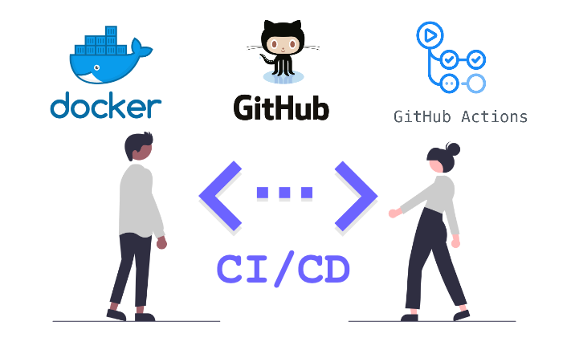

<h1 align="center"> 🍐 FREXCO DEVOPS 🍐 </h1>
Aplicação API em Django com PostgreSQL, utilizando containers Docker e Docker-Compose, disparando via Pipeline CI/CD com GitHub Actions 

  

## Objetivo do Desafio:
Considere que você foi contratado para subir uma aplicação (deploy) Api em Django + PostgreSQL, e você chegou a conclusão que a melhor forma de fazer isso é utilizando containers, como por exemplo as ferramentas Docker e Docker Compose. Então este desafio tem como objetivo testar a sua capacidade de fazer o deploy de uma aplicação e mostar noções de DevOps, em especial na parte de CI/CD (Integração contínua e Entrega contínua).

## Resumo:
✅ Requisitos de (1 até 7 + Extra) foram cumpridos com êxito

✅ Integração continua e também entrega contínua

✅ Cada vez que a Pipeline é executada o repositório no DockerHUB é atualizado.

## Construção e Desenvolvimento:
🐋 1. Criar Dockerfile com os dados da aplicação Python, instalando dependências.

🐋 2. Criar docker-compose.yml com imagem Nginx e PostgreSQL

🐋 3. Configurar portas no docker-compose e expor aplicação na porta 8005

🔁 4. Criação do Workflow no GitHub Actions CI:
        - Set up Python
        - Upgrade pip && Install psycopg2-binary
        - Run Docker-Compose
        
🔁 5. Criação segunda parte do Workflow no GitHub Actions CD:
        - Login to Docker Hub
        - Build and push Docker images

## Como efetuar o Deploy:
🐋 1. Para fazer o deploy e testar a aplicação em sua máquina é necessário instalar: Docker e Docker-Compose

🐧 2. Abrir um terminal e executar comando: "docker-compose up -d" ou "sudo docker-compose up -d" (aplicação irá rodar em background)

🐋 3. Para visualizar aplicação, abrir um browser e digitar: http://localhost:8005

## Links:

🔗 https://docs.docker.com/language/nodejs/configure-ci-cd/

🔗 https://docs.docker.com/ci-cd/github-actions/
